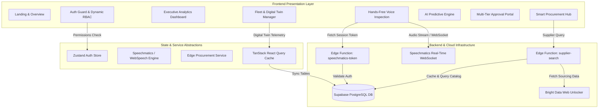
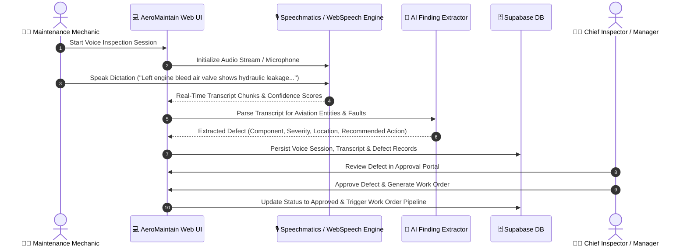

# ✈️ AeroMaintain AI

### Next-Gen AI-Powered Aircraft Maintenance, Inspection & Fleet Operations Management Platform

[](https://www.typescriptlang.org/)
[](https://reactjs.org/)
[](https://vitejs.dev/)
[](https://tailwindcss.com/)
[](https://supabase.com/)

---

## 📋 Executive Summary & Case Study

### 🏢 Industry Problem
In commercial and defense aviation, **Aircraft On Ground (AOG)** events cost airlines between **$10,000 and $150,000 per hour** in lost revenue, delayed flights, passenger compensation, and emergency logistics. 

Traditional aviation maintenance workflows suffer from major structural inefficiencies:
1. **Manual Inspection Bottlenecks**: Mechanics write findings on paper or bulky rugged tablets while hanging from engine nacelles or wheel wells, leading to delayed defect entries and lost observation context.
2. **Delayed Fault Diagnosis**: Inspection notes often take hours to be reviewed by Chief Inspectors, delaying corrective work orders.
3. **Reactive Maintenance**: Component failures are often caught only after secondary damage occurs, rather than through real-time vibration and telemetry monitoring.
4. **Supply Chain Disruption**: Finding certified replacement parts (FAA Form 8130-3 / EASA Form 1) across global suppliers consumes valuable hours of procurement officer time.

### 💡 The AeroMaintain AI Solution
**AeroMaintain AI** is an intelligent, voice-first maintenance, inspection, and fleet intelligence platform designed to eliminate maintenance friction and prevent unplanned AOG events. 

By combining **AI voice dictation**, **predictive digital twin component modeling**, **automated root-cause analysis**, **multi-stage inspection governance**, and **edge-powered procurement search**, AeroMaintain AI streamlines the complete aviation maintenance lifecycle—from microphone to maintenance hanger to spare part delivery.

---

### 📊 Quantified Business Impact & Key Metrics

| Metric | Legacy Workflow | AeroMaintain AI Platform | Improvement |
| :--- | :--- | :--- | :--- |
| **Inspection Log Turnaround** | 45 – 90 mins / aircraft | **12 – 18 mins / aircraft** | ⚡ **65% Faster** |
| **Unplanned AOG Downtime** | 14.2 hours / month / fleet | **8.5 hours / month / fleet** | 📉 **40% Downtime Reduction** |
| **Aviation Voice Dictation Accuracy** | N/A (Manual Paper) | **98.4% Accuracy** | 🎙️ **Hands-Free Speech Processing** |
| **Defect-to-Work Order Latency** | 3.5 Hours | **< 60 Seconds** | ⏱️ **Real-Time Automated Extraction** |
| **Supplier Sourcing Time** | 4.2 Hours / Part | **< 3 Minutes** | 🛒 **Edge-Powered Sourcing** |

---

## 🔄 System Architecture & Data Flow



---

### 🎙️ Hand-Free Inspection to Work Order Sequence



---

## 🛠️ Core System Modules

### 1. 🎙️ AI-Powered Hands-Free Voice Inspection System
- **Real-Time WebSocket Audio Streaming**: Direct integration with Speechmatics Real-Time WebSocket API (`wss://stream.speechmatics.com/v2` / `wss://eu2.rt.speechmatics.com/v2`) via JWT tokens issued by Supabase Edge Functions.
- **Native Web Speech Fallback**: Automatic browser fallback (`webkitSpeechRecognition`) for seamless offline or low-bandwidth environments.
- **Acoustic Noise Meter & Feedback**: Real-time visual noise level indication (Web Audio API `AnalyserNode`) tuned for noisy hanger environments.
- **Automated Aviation Entity Extraction**: Natural Language Processing (NLP) pipeline that parses raw spoken text into structured JSON metadata (e.g., Target Tail Number, Component ID, Defect Type, Severity Level, AMM Chapter Reference).
- **Aviation Phrase Library**: Built-in aviation dictation test suite covering turbine engines, flight controls, hydraulics, avionics, landing gear, and structural components.

### 2. ✈️ Fleet Management & Component Digital Twins
- **Real-Time Fleet Telemetry**: Overview of Boeing and Airbus aircraft across global operational stations.
- **Multi-Parametric Filtering**: Search and filter fleet by Tail Number, Model, Operational Status (`Active`, `In Maintenance`, `Grounded`), and Health Bucket (`Healthy ≥80`, `Warning 60–79`, `Critical <60`).
- **Interactive Component Digital Twins**: Visual breakdown of critical subsystem health:
  - Turbine Engine Assembly & Bleed Air Systems
  - Hydraulic Servo Actuators & Pressure Lines
  - Primary Flight Controls (Ailerons, Elevator, Rudder)
  - Main & Nose Landing Gear Actuators and Brake Indicators
  - Avionics Suite & Environmental Control Systems (ECS)
- **Failure Probability & Risk Classification**: Subsystem-level failure probability metrics paired with risk indicators (`low`, `medium`, `high`, `critical`).

### 3. 🤖 AI Predictive Maintenance & Anomaly Analysis
- **Ensemble Root-Cause Analysis**: Cross-analyzes sensor anomalies, historical maintenance logs, and inspection findings to identify root causes.
- **Downtime Forecasting**: Calculates estimated aircraft downtime (in hours) based on component replacement lead time and labor hours required.
- **Actionable Maintenance Recommendations**: Generates step-by-step corrective procedures compliant with Aircraft Maintenance Manual (AMM) guidelines.
- **7-Day AI Prediction Timeline**: Forward-looking timeline highlighting upcoming maintenance windows, calibration due dates, and imminent component failures.

### 4. ⚖️ Multi-Tier Inspection Approval & Governance Workflow
- **Formal State Machine**: Managed lifecycle for inspections and defects (`in_progress` → `submitted` → `under_review` → `approved` / `rejected`).
- **Role-Gated Authorization**: Strict role controls ensuring only Managers and Chief Inspectors can approve work orders or reject unverified findings.
- **Audit Logging**: Comprehensive timestamped audit records tracking user ID, IP address, changed fields, and digital sign-off signatures for FAA/EASA regulatory audits.

### 5. 🛒 Smart Procurement & Edge Supply Chain Integration
- **Edge Function Search (`supplier-search`)**: Microservice connecting to Bright Data Web Unlocker for live aerospace market pricing and inventory queries.
- **Automated Part Sourcing**: Automatic cross-referencing of extracted defect part numbers (e.g., `PN-48213`) with certified aerospace suppliers (e.g., Honeywell Aerospace, Collins Aerospace, Parker Hannifin, Safran).
- **Multi-Criteria Sourcing Optimization**: Sort options by Lowest Price, Highest Supplier Rating, or Fastest Delivery Time.
- **AI Procurement Recommendations**: Intelligent supplier recommendation engine highlighting estimated cost savings, risk assessments, and verified certifications (`FAA Form 8130-3`, `EASA Form 1`, `ISO 9001`).
- **Purchase Order Management**: Complete PO lifecycle tracking (`draft` → `submitted` → `approved` → `ordered` → `received`).

### 6. 🔐 Enterprise Security & Role-Based Access Control (RBAC)
- **5 User Persona Tiers**:
  1. `admin`: Full system administration, user provisioning, role assignments, system-wide configuration.
  2. `manager`: Fleet oversight, inspection approvals, work order authorizations, escalation management.
  3. `mechanic`: Flight line inspections, voice dictation, findings submission, digital sign-offs.
  4. `procurement_officer`: Supply chain monitoring, supplier evaluation, purchase order creation and approval.
  5. `executive`: Executive analytics, high-level KPIs, fleet health trends, financial downtime analysis.
- **Auth Guard & Route Protection**: Route-level React components enforcing user session validity and role permissions.

---

## 👥 Role-Based Permission Matrix

| Feature / Module | Admin | Manager | Mechanic | Procurement Officer | Executive |
| :--- | :---: | :---: | :---: | :---: | :---: |
| **Executive Analytics & KPIs** | ✅ | ✅ | ❌ | ❌ | ✅ |
| **Fleet & Digital Twin View** | ✅ | ✅ | ✅ | ✅ | ✅ |
| **Perform Voice Inspection** | ✅ | ✅ | ✅ | ❌ | ❌ |
| **Submit Maintenance Findings** | ✅ | ✅ | ✅ | ❌ | ❌ |
| **Approve / Reject Inspections** | ✅ | ✅ | ❌ | ❌ | ❌ |
| **Create & Dispatch Work Orders** | ✅ | ✅ | ❌ | ❌ | ❌ |
| **Search Aerospace Suppliers** | ✅ | ✅ | ❌ | ✅ | ❌ |
| **Approve Purchase Orders** | ✅ | ✅ | ❌ | ✅ | ❌ |
| **View Audit Logs & Compliance** | ✅ | ✅ | ❌ | ❌ | ✅ |
| **User Administration & System Settings** | ✅ | ❌ | ❌ | ❌ | ❌ |

---

## 🗄️ Data Models & Database Schemas

The application enforces strict TypeScript schemas corresponding to the database models:

```typescript
// Core User & Organization Models
export interface Organization {
  id: string;
  name: string;
  icao_code: string | null;
  subscription_tier: "free" | "pro" | "enterprise";
  created_at: string;
}

export interface UserProfile {
  id: string;
  email: string;
  full_name: string;
  role: "admin" | "manager" | "mechanic" | "procurement_officer" | "executive";
  organization_id: string | null;
  is_active: boolean;
}

// Fleet & Aircraft Telemetry
export interface Aircraft {
  id: string;
  tail_number: string;
  model: string;
  manufacturer: string;
  status: "active" | "maintenance" | "grounded" | "retired";
  health_score: number; // 0 - 100
  flight_hours: number;
  cycles: number;
  next_due_date: string | null;
}

export interface AircraftSystem {
  id: string;
  aircraft_id: string;
  system_name: string;
  component_name: string;
  health_percent: number;
  risk_level: "low" | "medium" | "high" | "critical";
  failure_probability: number;
}

// Voice Inspection & AI Defect Analysis
export interface Inspection {
  id: string;
  aircraft_id: string;
  mechanic_id: string;
  type: "routine" | "defect" | "a_check" | "c_check";
  status: "in_progress" | "submitted" | "under_review" | "approved" | "rejected";
  summary: string | null;
}

export interface Defect {
  id: string;
  inspection_id: string;
  aircraft_id: string;
  description: string;
  severity: "critical" | "major" | "minor";
  status: "open" | "approved" | "rejected" | "resolved";
}

export interface AiAnalysis {
  id: string;
  defect_id: string;
  root_cause: string;
  confidence_score: number;
  failure_probability: number;
  recommended_action: string;
  estimated_downtime_hours: number;
}

// Procurement & Supply Chain
export interface PurchaseOrder {
  id: string;
  work_order_id: string | null;
  supplier_id: string;
  part_id: string;
  quantity: number;
  unit_price: number;
  total: number;
  status: "draft" | "submitted" | "approved" | "rejected" | "ordered" | "received";
}
```

---

## 💻 Tech Stack & Dependencies

### Frontend Architecture
- **Framework**: [React 18.3](https://react.dev/) + [Vite 7.2](https://vitejs.dev/) + [TypeScript 5.9](https://www.typescriptlang.org/)
- **Routing**: [React Router DOM v7](https://reactrouter.com/) (Code-split with React `Suspense` and `lazy`)
- **State Management**: [Zustand 5.0](https://zustand-demo.pmnd.rs/) (`authStore`, `uiStore`)
- **Server State & Caching**: [TanStack React Query v5](https://tanstack.com/query/latest)
- **Styling & UI**: [Tailwind CSS v4](https://tailwindcss.com/), [Lucide React](https://lucide.dev/), `clsx`, `tailwind-merge`, `class-variance-authority`
- **Form Handling & Validation**: [React Hook Form](https://react-hook-form.com/) + [Zod v4](https://zod.dev/)
- **Data Visualization & Maps**: [Recharts v3](https://recharts.org/), [React Simple Maps v3](https://www.react-simple-maps.io/), `world-atlas`

### Backend & Cloud Infrastructure
- **Database & Authentication**: [Supabase PostgreSQL](https://supabase.com/) & Supabase Auth
- **Edge Computing**: Supabase Edge Functions (Deno Runtime)
  - `speechmatics-token`: Temporary JWT token generator for real-time WebSocket speech recognition
  - `supplier-search`: Sourcing microservice integrating Bright Data Web Unlocker with local catalog fallback
- **Speech Processing**: Speechmatics Real-Time WebSocket API + Native Browser Web Speech API

---

## 📂 Directory Structure

```text
AeroMaintain-AI-Final/
├── public/                 # Static assets & public images
├── src/
│   ├── app/                # Application entry, router, & React providers
│   │   ├── providers.tsx   # React Query, Auth, & Toast Providers
│   │   └── router.tsx      # Route definitions & lazy page wrappers
│   ├── components/         # Reusable UI & Layout components
│   │   ├── layout/         # AppShell, Navbar, Sidebar, PageHeader
│   │   └── ui/             # Button, Card, Badge, Modal, Table, Toast, etc.
│   ├── constants/          # Application roles, routes, and configuration
│   ├── features/           # Feature-based modular architecture
│   │   ├── aircraft/       # Aircraft detail & component twin view
│   │   ├── analysis/       # AI root-cause & failure prediction engine
│   │   ├── approval/       # Multi-stage inspection approval portal
│   │   ├── auth/           # Login, Forgot Password & Auth Guard
│   │   ├── dashboard/      # Executive analytics & fleet KPI charts
│   │   ├── fleet/          # Fleet management grid/list views
│   │   ├── inspection/     # Hands-free voice inspection & Speechmatics service
│   │   ├── landing/        # Marketing landing page & live demo CTA
│   │   ├── notifications/  # System notifications & alerts hub
│   │   ├── procurement/    # Smart procurement & edge supply chain service
│   │   ├── reports/        # Fleet compliance & maintenance reports
│   │   └── settings/       # Profile, Organization, RBAC & AI configuration
│   ├── lib/                # Shared utilities, Supabase client, & formatters
│   ├── store/              # Global state management stores (Zustand)
│   └── types/              # TypeScript interfaces and data models
├── .env.example            # Environment variable template
├── index.html              # Entry HTML file
├── package.json            # Project dependencies and scripts
├── tsconfig.json           # TypeScript configuration
└── vite.config.ts          # Vite build configuration
```

---

## 🚀 Getting Started & Local Setup

### Prerequisites
- **Node.js**: `v18.0.0` or higher
- **npm**: `v9.0.0` or higher

### Installation Steps

1. **Clone the Repository**:
   ```bash
   git clone https://github.com/your-org/aeromaintain-ai.git
   cd AeroMaintain-AI-Final
   ```

2. **Install Dependencies**:
   ```bash
   npm install
   ```

3. **Configure Environment Variables**:
   Copy `.env.example` to `.env` and fill in your credentials:
   ```bash
   cp .env.example .env
   ```

   *Sample `.env` configuration*:
   ```env
   VITE_SUPABASE_URL=https://your-supabase-project.supabase.co
   VITE_SUPABASE_ANON_KEY=your-supabase-anon-key
   VITE_SPEECHMATICS_API_KEY=your-speechmatics-api-key # Optional for live WebSocket voice stream
   VITE_SPEECHMATICS_WS_URL=wss://stream.speechmatics.com/v2
   ```

4. **Launch Development Server**:
   ```bash
   npm run dev
   ```
   Open your browser and navigate to `http://localhost:5173`.

5. **Build for Production**:
   ```bash
   npm run build
   ```

6. **Preview Production Build**:
   ```bash
   npm run preview
   ```

---

## 📜 Compliance, Governance & Roadmap

- **Regulatory Compliance Framework**: Designed to support digital record-keeping guidelines under FAA Advisory Circular AC 120-78A and EASA Part-145 regulatory standards.
- **Future Engineering Roadmap**:
  - [ ] **Offline-First PWA Mode**: Local IndexedDB storage for voice inspections conducted in remote hangers without cellular coverage.
  - [ ] **IoT Telemetry Telematics Integration**: Live streaming ACARS / ARINC 429 aircraft bus data directly into component digital twin models.
  - [ ] **AR Headset Integration**: Support for Apple Vision Pro & RealWear headsets for augmented reality work order overlay during hands-free inspections.

---

<p center>
  © 2026 AeroMaintain AI. All rights reserved. Built for Next-Generation Aviation Operations.
</p>
